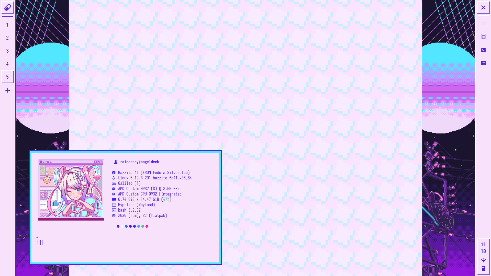
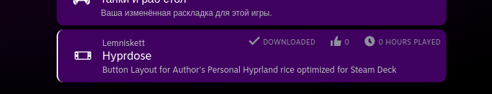
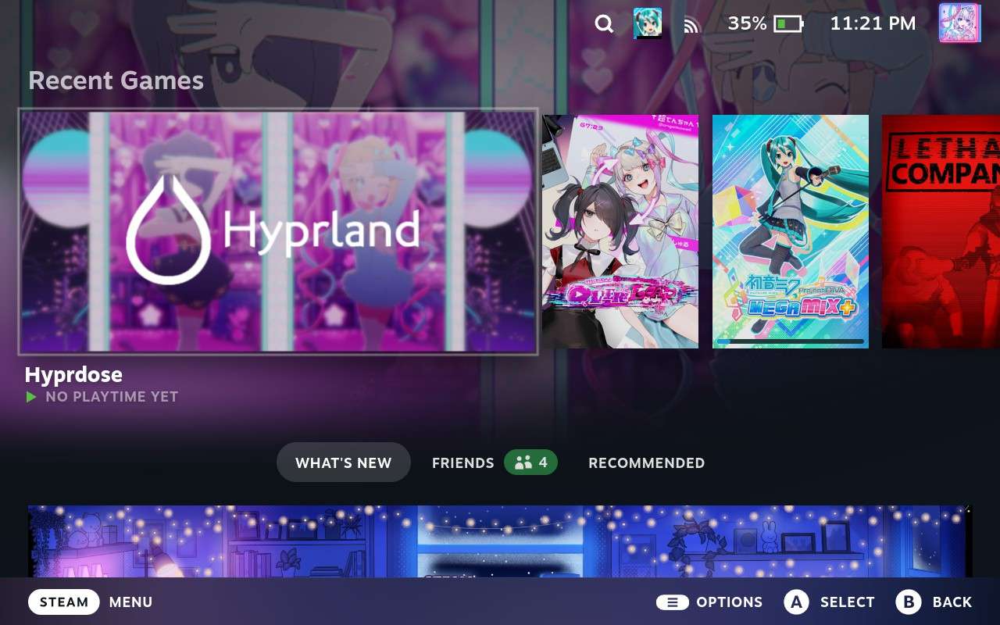

# Hyprdose

My attempt at making Hyprland usable in Steam Deck, obviously has [Needy Girl Overdose](https://store.steampowered.com/app/1451940/NEEDY_STREAMER_OVERLOAD/) nuance.



## Installation

Add `angelctl` to your path, then stow everything inside desktop directory.

```sh
cd desktop
echo ". ~/.angelbash" >> ~/.bashrc
stow -t ~ .
```

## Dependencies

See [`build.sh`](https://github.com/lemniskett/bazzite-deck-hyprdose/blob/master/build.sh)

## Steam Deck Button Configuration

It's recommended to use my layout in the community section of "Desktop Layout"



## Steam Library Capsules

Use SteamGridDB to change Banner, Icon, and Capsules using images in this repository.



## Credits

I don't own any artworks in this Repository, all credits goes to:

- [WSS Playground](https://store.steampowered.com/publisher/WSSplayground)
- [@Chalm_S on X](https://x.com/Chalm_S/status/1488378365266788352)
- [@673_q on TikTok](https://www.tiktok.com/@673_q/video/7375153978679577889)